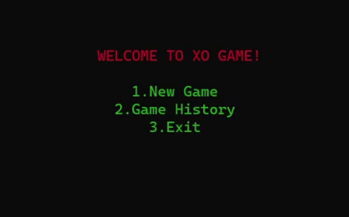
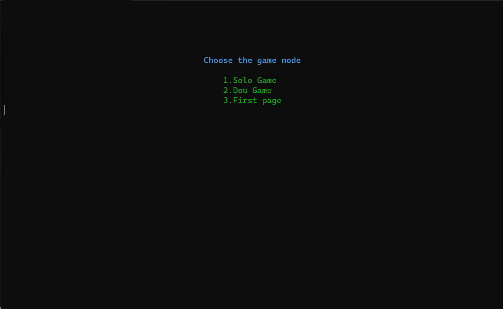
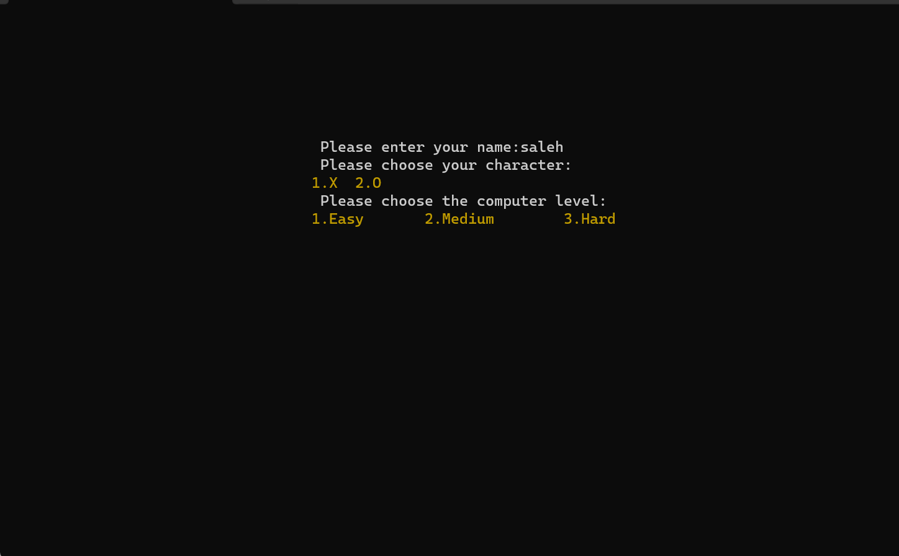
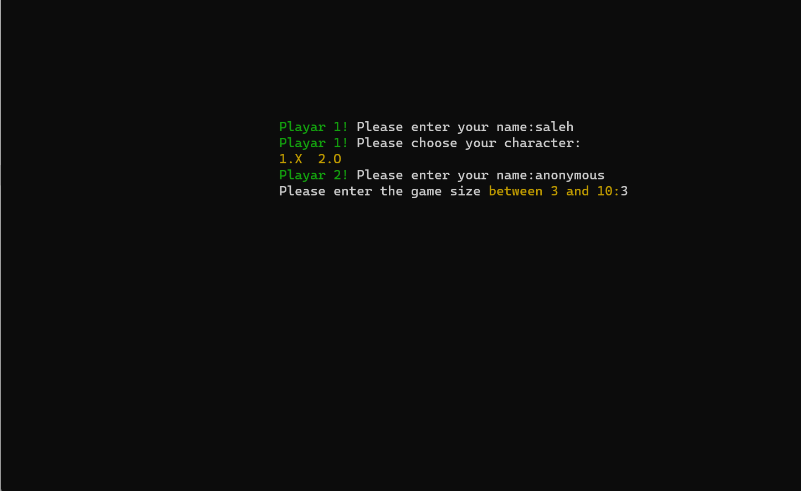
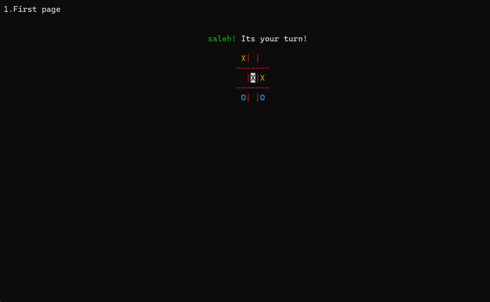
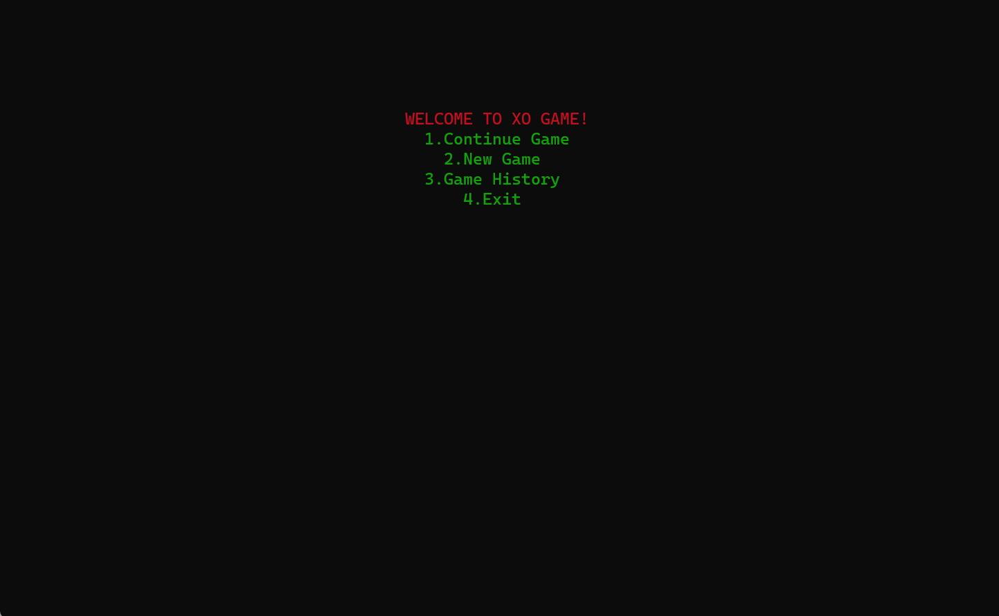

# Tic-Tac-Toe Game

This is my first mini-project after a month of learning the fundamentals of programming. It’s a simple Tic-Tac-Toe game where you can either play alone (against the computer) or with a friend in two-player mode.

### Features:

- **Single Player Mode**: Play against the computer, which has three difficulty levels: Easy, Medium, and Hard. The AI algorithms for these levels are implemented with basic logic, perfect for a beginner project.
  
  

- **Two Player Mode**: Play with a friend locally.

  

  - **Controls**: Use the WASD keys to navigate and the Spacebar to make a move.
  
  

- **Console Graphics**: The game's visuals are designed to look appealing in a console environment.
  
  
  

- **Additional Features**:
  - Sound playback.
  [Download the Main Page video](readme-media/MainPage.mp4)
  [Download the Main Page video](readme-media/Win.mp4)
  [Download the Main Page video](readme-media/GameOver.mp4)

  - Game history to review previous moves.
  

  - The ability to continue from where you left off in your last game.
  
  

Creating this simple project at the beginning of my programming journey has been an exciting and rewarding experience!
